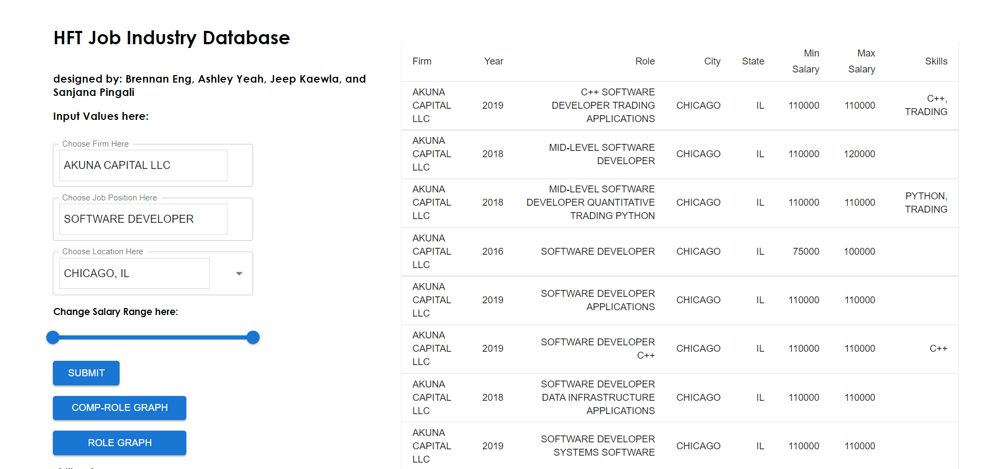
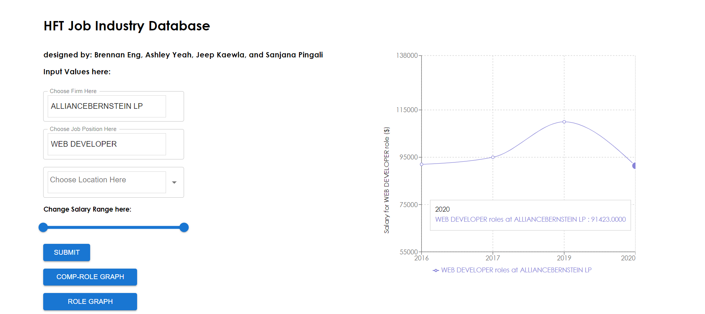
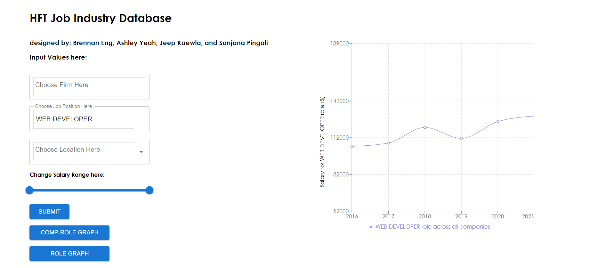
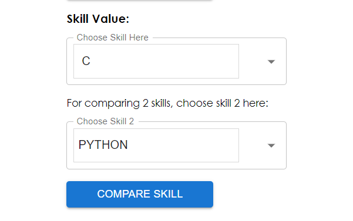
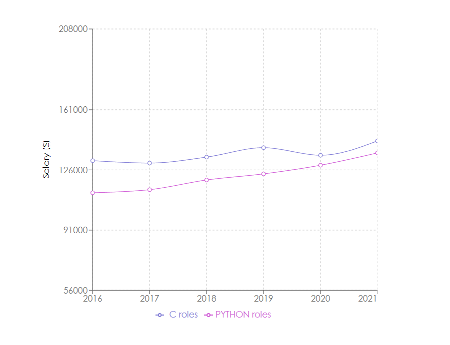

# A Government and Public Data derived Datawarehouse for Job Opportunities in the FinTech Space

## Team:

  * **Brennan Eng** [brennanheng@gmail.com](brennanheng@gmail.com): <br>

    Brennan is a current Junior at the University of Illinois at Urbana-Champaign majoring in Computer Engineering. Brennan is graduating May 2023. In the summer of 2022, Brennan will be interning at Sychrony Financial as a Software Development Engineering intern. Brennan enjoys financial engineering, derivatives trading, programming in python and C++, focusing on data analysis and automation. To check out Brennan's specific projects checkout his [github](https://github.com/Brennaneng).

  * **Chayanid "Jeep" Kaewla** [ckaewla2@illinois.edu](ckaewla2@illinois.edu): <br>
    Jeep is a rising senior at the University of Illinois at Urbana-Champaign studying Computer Engineering. Jeep is graduating May 2023. In the summer of 2022, Jeep will be interning at Amazon as a Software Development Engineer intern. Jeep intends to pursue Master of Science in Computer Science in the Fall of 2023. Jeep is interested in HFT and innovating educational applications and devices. You can checkout more projects that Jeep has done [here](https://jeeepx.github.io/mySite/).

  * **Sanjana Pingali** [pingali4@illinois.edu](pingali4@illinois.edu): <br>
    Sanjana is a rising senior at the University of Illinois at Urbana-Champaign planning to graduate with a Bachelor of Science in Computer Engineering in May 2023. Sanjana will be a research intern with the National Center for Supercomputing Applications at the University of Illinois Urbana-Champaign the Summer of 2022. Sanjana is interested in the fields of machine learning, data analysis and software development.

  * **Ashley Yeah** [ashelyeah@gmail.com](ashelyeah@gmail.com): <br>

    Ashley is a rising senior at the University of Illinois at Urbana-Champaign planning to graduate with a Bachelor of Science in Computer Science in May 2023. In the summer of 2022, Ashley is interning at Uber as a Software Engineer Intern. Ashley is always curious about innovations in technology, especially in the fields of database systems, machine learning, and software development tools. You can checkout more about Ashley [here](https://ashleyyeah.github.io/).

*** 

## Project Description:

  [Link to Project Video](https://drive.google.com/file/d/1AGIBNK9-KmrMDIr8aBwMrimk63ZdAR-u/view?usp=sharing)<br>
  This is the team's _"IE498 – High Frequency Trading"_ semester long project under the supervision of Professor David Lariviere [link to his webpage](https://davidl.web.illinois.edu/). This project is a public data and government dervied datawarehouse specifically for financial technology job opporunities. This application uses HFT-related data sources including Indeed Job Postings, NSCC Documents, performance data from the US Department of Labor, H1B work visa documents from USCIS (US Citizenship and Immigration Services), NSCC-MPID, and SEC data. Most of these documents are required by FinTech companies to be submitted publically to the US government ranging from hiring non US Citizens to locations of their offices.


  This project collects data using a variety of methods including webscraping and simple downloads. It then aggregates the data from all sources using [Reconcile-csv](https://okfnlabs.org/reconcile-csv/), which relies on [OpenRefine](https://openrefine.org/), an open-source tool that allows for fuzzy matching in order to group relevant and similar values from different data sources together and eliminate occurences of duplicate data. Once the data is collected and cleaned, Pandas, a powerful python data analysis tool is used to eliminate unnecessary information and format the data into coherent, unifed, and organized datasets, each with their own unique IDs. Loading the datasets onto our SQL database, we are able to utilize web development technologies to create a friendly user environment to interact with our dataset.

  The GUI has 4 main features to showcase based on the search paramteres given by the user. 
  1. A data table that will display values from our database.
  2. A graph that will display a historical salary trendline specifically for the company.
  3. A graph that will display a historical salary trendline for the particular position averaged across all companies with the position
  4. A graphical comparison of historcial salary trendlines between 2 selected skills averaged across all positions and companies that have the skill listed

***
## Technologies:
  - Database:
    - [MySQL](https://dev.mysql.com/doc/) - database management system that allows you to store, manipulate, and define a relationship of each table
  - Web Developement:
    - Frontend: [React](https://reactjs.org/)
      - React Libraries:
        - Autocomplete fields: [Mui autocomplete](https://mui.com/material-ui/react-autocomplete/)
        - Salary Slider: [Mui slider](https://mui.com/material-ui/react-autocomplete/)
        - Display Graphs:[ Recharts](https://recharts.org/en-US/)
        - Display Tables:[ Mui](https://mui.com/)
    - Backend: Flask
        - Handling Cross Origin Resource Sharing: [CORS](https://flask-cors.readthedocs.io/en/latest/)
        - MySQL connection to Python backend:[ Flask-mysqldb](https://flask-mysqldb.readthedocs.io/en/latest/) 
  - Webscraping:
    - [Python](https://www.python.org/) - a high level programming language with readily available data structures. Attractive for a quick application development.
    - [Beautiful Soup](https://beautiful-soup-4.readthedocs.io/en/latest/) - Python library used for obtaining data from HTML (our case) or XML files
  - Data Cleaning and Formatting:
    - [Python](https://www.python.org/)  - a high level programming language with readily available data structures. Attractive for a quick application development.
    - [Pandas](https://pandas.pydata.org/) - an open source tool built from Python to help with data analysis
    - [Reconcile-csv](https://okfnlabs.org/reconcile-csv/) - service from OpenRefine used for fuzzy matching so that we can easily join data from different sources
    - [OpenRefine](https://openrefine.org/) - tool for cleaning messy data
    - [USPS Address Validation](https://github.com/IndianaCHE/USPS-Address-Verifier) - a tool to help formats addresses <br>
    #### Other Technologies that we initially considered:
    - [Glassdoor API](https://www.glassdoor.com/developer/companiesApiActions.htm) - allows us to obtain information about different firms'company, job role, skills, and salary when making a request. The reason we did not use this technology is because they never grant us the publisher access. When attempt to web scrape they website, we got also blocked.
    - [OpenSkill API](https://github.com/workforce-data-initiative/skills-api/wiki/API-Overview?ref=public-apis#introduction) - normalized skill names, find associated job for a skill, find associated skills for a job when we make a request. The data sources of these endpoints of interest were available to the public at that time. The available endpoints at that time were complicated to use, and appeared to be not that useful to our project.
***
## Components:

  A diagram to showcase our components:

  

  - Database:
    - The database receives all data manually which has been cleaned and formatted through our **Data Formatting** process.
    - Once the virtual machine has been created with our sql database instantiated, the **Backend** programs will run automated SQL queries based on the search parameters received from the **Frontend** UI. 
    - The SQL database structure will look like this: 
    - Once those SQL queries have been created, the SQL database will send the specified data to the **Backend**.
  - Web Development:
    - Frontend:
      - Input (search parameters to be sent to the **Backend**):
        - The Frontend has been built with several autocomplete search bars for the user to create a custom search for available FinTech firms, available positions, available locations, and a specific salary range. Based on the selections, the **Backend** will automatically send an updated list of options available to choose from for the remaining blank search bars.
        - Another feature would be the skills-salary comparison which is comprised of two autocomplete search bars that searches up skills listed in our database.
      - Output (data to be received from the **Backend**):
        - Once those search bars have been selected to the user's parameters, there are available buttons that all have different function calls for the **Backend**. 
          - The submit button will bring up a table with all data values from the **Backend** relevant to the search parameters.
          - The comp-role graph button will bring up a graph of a historical salary trendline of the position in the company.
          - The role graph button will bring up a graph of historical salary trendline of the position averaged across all companies.
          - The skill button will bring up a comparison graph between 2 historical salary trendlines of positions containing the searched skills.
    - Backend:
      - Received from the **Frontend**:
        - The Backend will receive a specific function call relating to a **Frontend** button with the provided search parameters of the **Frontend** search boxes.
      - Sent to the **Frontend**:
        - The Backend will send compiled JSON formatted files with relevant data for the **Frontend** to view and display.
      - Received from the **SQL Database**:
        - The **SQL database** will send back relevant data to the queries and the python program will perform any necessary changes to the data format.
      - Sent to the **SQL Database**:
        - The Backend will have customized queries based on the **Frontend** parameters that it will send to the **SQL Database** so that it can search for relevant data.
  - Webscraping:
    - Utilized Python web scraping tools for relevant data sources mentioned in **Project Description**.
  - Data Formatting
    - Utilized [Reconcile-csv](https://okfnlabs.org/reconcile-csv/) in order to compare and recognize the same companies under slightly different names
    - Used Python functions and Pandas to aggregate data from all sources into combined csvs with unique ID's, which are used by the **SQL Database** to sort by.

***
## Git Repo Layout:
  - Backend:
    - contains the file app.py which manages all the custom queries to the SQL database based on the search parameters of the Frontend.
  - Companies, Company_role_skills, Company_role_specs, H1b_CSV, Roles, SEC_CSV:
    - contains jupyter notebooks that contain processes used to extract and compile the corresponding csv, as well as the raw and cleaned, formatted data of the SQL database in csv format.
  - Indeed_scraping:
    - contains a web scraping python file for the indeed website to retrieve data about FinTech job opportunities.
  - Interface:
    - contains the Frontend design as well as the customized graph and table displays that is received from the Backend
  - Mysql:
    - contains a shellscript that automatically loads the VM with the required SQL dump.
  - Provision_scripts:
    - contains the shellscript to begin the whole application with the command line "vagrant up --provision" as well as install other necessary packages for the project.
  - Skills:
    - contains a python script that extracts and compiles a list of skills from the previously mentioned cleaned, formatted data.
  - WebScrape:
    - contains python files that web scrapes the [H1B website](https://h1bdata.info) for necessary data and formats them.
  - Vagrantfile:
    - Ruby file that helps instantiate the Vagrant VM.
***
## Instruction for Running the Project:
  1. Install:
    * Fedora-35
    * Vagrant
    * Oracle VM Virtualbox
  2. Type into terminal ```git clone https://gitlab.engr.illinois.edu/ie598_high_frequency_trading_spring_2022/ie498_hft_spring_2022_group_06/group_06_project.git```
  3. Type into terminal ```vagrant up --provision``` to start the VM
  4. SSH into a terminal with the host as **mysql** and the password as **vagrant** and it should pop up the user as **vagrant@mysql**
  5. Type into VM terminal ```git clone https://gitlab.engr.illinois.edu/ie598_high_frequency_trading_spring_2022/ie498_hft_spring_2022_group_06/group_06_project.git```
  6. Type into VM terminal ```(cd group_06_project && (cd backend ; flask run --host=0.0.0.0 --port=5000 &) && (cd interface ; npm start &))```
  7. The application should pop up in a web browser as an interface for the user.
  8. Enjoy using our GUI and the database behind it!
***
## Testing:
  - Backend
    - Unit testing on all Flask routes is done using the python library [pytest](https://docs.pytest.org/en/7.1.x/).
    - To access the tests from the VM home, use shell command ```cd group_06_project && (cd backend ; pytest) ```
  - Frontend
    - Unit testing in the frontend is done using the library '@testing-library/react' (https://testing-library.com/docs/react-testing-library/intro/).
    - These tests check the different aspects of the frontend components to check if they work (i.e submit buttons, sliders, text on screen etc.)
    - These tests can be run by changing directory into 'interface' directory and then 'src' directory. Then change to the "\_\_tests__" directory and run the command 'npm run test'

***
## Project Results:
The final results for the project are in the form of two deliverables that are displayed on the frontend of the website. The first is the table that is the result of the querying done when the search options are filled up. This query is then filled up in the table which can be seen on the side when we hit submit. Another way, the data is displayed is in the form of three graphs one that shows how positions and their salaries have changed over time, another of how salaries of different positions have changed over time and finally, comparing the roles in the same company.These data analytic features are especially useful for job seekers as they would be able to make an informed decision when applying for a position or adopting a new technology based on the salary trend over the year. These features would also enable Fintech firms to see how competitive their salaries are compared to their competitors. They would also gain more insight into the ratio of each job role at their competitor.Educational institutes could also use this database website to structure their course such that it teaches the technology that the industry values.

***
## Screenshots and Example Outputs:
### Table Output:
The user can view all entries that fit the user's search parameters using the **`submit`** button.
  
### Company - Role Graph Output:
The user can view historical salaries of the role within the company based on time with the **`comp-role graph`** button.

### Role Graph Output:
The user can also view historical salaries on the specified role based on time with the **`role graph`** button.

### Compare Skills Output:
 The user can also view and compare different skills and the impact of those salaries based on those skills. Below the other buttons, we can select two different skills to compare and the trend of the salaries containing those skills on the graph. The user can see these with the **`compare skill`** button. <br>
Input SKills:
<br>
Graph output:



Post Mortem Summary:

Brennan Eng

Specifically what I did for the project was host meetings and delegate tasks to other group members. I was in charge of recording meetings and submitting deliverables for the project. I organized meetings and discussed strategies on how to refine and improve the architecture of the project as a whole. 
Backend: Set up the flask backend and connected it to the SQL database with imported libraries and created dummy scripts to make sure the JSON formatted file outputted correctly. 
Frontend: created the frontend app and initially created a raw design of what the front end application should look like, but later added other imported libraries to improve the overall experience of the UI for the user such as Autocomplete fields and Sliders. Began working on pulling data from the Backend. 
ShellScript: Install different packages automatically through the shell script when the VM is instantiated in order for the application to have the necessary languages to complete its task .. 
Documentation: Wrote Project description, added onto Technologies, Components, Git Repo Layout, and Instruction for Running Project in the FinalProject file. Wrote majority of the Readme file for users to view.
Through this project, I learned a lot of new programming languages as well as new methods to connect languages with each other. I learned a lot about the React app library as well as how it plays with a Python Flask backend. I definitely learned a lot about how to create better GUI’s with existing libraries and its many uses to display the data received from the backend.
If I could go back to the beginning, obviously starting earlier with a more concrete plan is on everyone’s mind. I feel as though we had our ball roll very slowly in the beginning and only once sitting down and discussing further on what our plans were that we made any headway.
If we were to continue working on this project, I think I would improve the UI to make it look nicer and more presentable if the application were to ever be published on a website. I would also deploy more custom features to apply onto our dataset as well as improve our data source collection through the implementation of automation.
Some advice I would offer is to try and learn something new in a project like this. The implications of our project are very important, but the foundations of what created will remain with you forever.<br>
Jeep Kaewla
1. #### Database:
- web scrape the H1B database using Pandas, Beautiful Soup, and Python to fill all the tables in our database schema
- compare the data obtained with the data obtained from the SEC website and filter out repeated companies using the fuzzy match feature from Reconcile-CSV, which help normalizes the company name and remove the matched company's name
- wrote Python scripts to:
  - filter out non-financial firms and keep high confidence in financial firms based on the name of the company 
  - reformatting data obtained from H1B to fit our database schema
- add non-repeated companies from NSCC_MPID to the database<br>
The main challenge of the H1B database is that there is no easy way to obtain only financial-related firms. To solve this problem, I began web scraping known HFT and financial institutes and keeping track of the frequency for each job role in the hope that I would find companies with similar frequencies for each job role. However, the frequency distribution seems to vary from firm to, so I compiled a superset of job roles from these known firms instead. I then use the superset of job roles I collected to web scrape the H1B database for a list of financial firms, and this enables me to fill other tables in the database more efficiently.
#### Backend
- wrote four backend routes that each execute a SQL query
- Three of the routes are used for getting the data to display on the three graphs we have on our website (comp-role, role, and skills)
- One backend route for the submit button to fetch the correct data from the database
- set up the CORS (cross-origin resource sharing) for our backend to communicate with the frontend properly
#### Frontend
- wrote the code for displaying (and hiding) the three graphs on our website using recharts library
- ensure that all our buttons fetch the correct backend route and format the returned data to be displayed on the graphs properly
- change the code structure so that we can have access to the useState in our return function and accomplish what we want to do
- actively finding bugs and test our frontends
- helped with the CSS file to ensure that all the components are displayed at a desirable location
#### Documentation: write and edit the final report, design document, and README

2. Before this project, I did not know how to do web scraping or build a react-flask-MySQL web application. After doing this project, I did not only learn how to do web scraping and build react-flask-MySQL web applications, but also how to effectively adopt new skills. Since we are handling a huge amount of data, upon reflection, I realized I also learned to ask myself questions that will improve my efficiency and accuracy, such as "How might I be able to speed up this process while maintaining accuracy." The answer often is to write more scripts. Last semester, I took a database course; in doing this project, I got to utilize that knowledge by designing the database and finding inconsistencies in database tables. This is the perfect opportunity to turn my knowledge from last semester into a tangible product. Learning this skill is very important because it is not something we learn in a theoretical class.
3. We should have allocated more time to the data analysis parts of the project. Currently, we can display the tables and three graphs. If we put more time into this, I think it is very likely that we would be able to obtain even more interesting insights about job roles and trends in the fintech space. This would make our project valuable for job seekers and educational institutes. HFT firms would also gain more insights into their competitors' job roles and salaries. 

4. 
- I would want all the processes in web scraping the data from different databases to be automated so that this project will still be meaningful in the far future. This seems complicated since all the websites we webscrape might change their source code, and the same web scrape code might not work anymore. We might create some alert to notify us if one of the websites we obtained data from changes its website format and then changes the web scrape code accordingly.
- I would find an algorithm to better normalize and match the same companies across all databases. This would also mean an overall more automated process, too. Even though Reconcile.csv worked okay, there were still many manually matching low confidence level companies' names. My suggestion for this might be to utilize edit distance algorithms combined with machine learning to better normalize and match the company's name.

5. 
- Stackover flow is your best friend. If that doesn't solve your problem, don't be afraid to ask your group members or the professor for help when you are clueless about what to do or when you have seemingly 'unsolvable bugs.' You will get to save a lot of time and can spend more time doing more meaningful work.
- The more effort you put in, the more you learn.
Learning a new technology is not as hard as you initially thought if you are willing to spend time on it. 
- If you have a not-too-busy semester, you can adopt new technology while doing your project.
Evaluate your class schedule and, based on that, choose an obtainable project, considering how busy you will be.

Ashley Yeah

What I did?
Data Collection and Organization:
Focused primarily on cleaning and collecting data specifically from the performance data from the US Department of labor in recent years
Downloaded and removed unnecessary information in the PERM datasets
Downloaded SEC data on registered broker-dealers and normalized addresses of companies to help better match between the datasets
Used Reconcile-csv to compare and fuzzy match SEC data and PERM data to find companies that were finance/trading related
Finding good matches was hard, even using machine learning techniques included with reconcile-csv, so some of the matching where the confidence was not as high had to be done by manually
Also utilized python functions and pandas to look for companies that had specific roles related to trading and quant to find more financial related companies.
There are still a lot of finance related companies that are not broker-dealers so we had to use reverse searches on common high-frequency trading roles to find which companies in the database offered such roles and add such companies
Reformatted and removed duplicates from remaining PERM data using pandas dataframe functions
For each database table to be created, merged cleaned data from the H1B source and the PERM source together to form a single csv
Database:
Roughly designed the schema of our database
Created each of the 6 tables in our MySQL database
Added primary keys and foreign keys to maintain unique values and connections between tables
Exported dump of the complete database to allow scripted database initialization on the VM
	Backend:
Created 4 route functions each with a sql query that served to pull a list of options from the companies, roles, and skills tables, as well as a list of locations of where roles are located
Edited the final query used for the submit button to included all needed fields in a dictionary formatted result
	Frontend:
Utilized the routes I created in the backend to pull and display a list of options for each of the autocomplete fields on the page
Setup functions to allow for dynamic changes in the options of each autocomplete field as the user completes the fields to eliminate choices that are not possible
Added table functionality for when the submit button is utilized to display relevant data in a cohesive way
Testing:
Wrote testing functions that use pytest for each of the routes in the Flask backend 
	Documentation: 
Created database schema and architecture diagrams
Helped edit design document and final report
What I learned?
Basic usage of ReactJS. Before this project, I had basic exposure to using MySQL and Flask as I had utilized these technologies in prior projects. However, I had never touched React or javascript at all and it was an extremely rewarding experience to dive head first into a new language and learn the basic usages of it.
The importance and convenience of using a VM. I had never really worked with virtual machines and tools such as vagrant and through this project, I now realize how important and useful virtual machines can be in standardizing each perons’s workflow as well as allowing new users and project participants to onboard easily by automating a lot of the setup and package installation processes.
What would I have done differently?
I think we stumbled quite a bit when collecting and aggregating our data because we underestimated the sheer scope of how hard it would be to deal with the data so I wish we had been more diligent at the beginning of the project so we could maximize our time on these issues and also do more research into different methods of matching and cleaning.
Because we spent so much time on collecting data, we didn’t have as much time to develop the features that actually utilize our data so I wish we had started working on the second half of the project a bit earlier
Continued Development
I would love to explore the potential of adding in more data sources as well as more comprehensive data including roles that span back further in years as currently our data is a bit limited
We also manually created our skills table which is not ideal and I would prefer to look into using an existing data source or other aggregation methods to create a more comprehensive list of skills
Similarly to what others have said, I think it would be good to automate more of the preprocesses in our project, including the data collection and cleaning process, although this would be the hardest part to improve as messy data is very hard to work with.
Advice
If you’re working on a database and data analytics related project, it is not the analytics but the data collection, cleaning, and formatting that are the most challenging part. Having to deal with extremely messy data with many different formats from many different sources was a problem I hadn’t faced before and it was the most challenging part of this project as there simply wasn’t a uniform and automated way to deal with messy data. Despite our best efforts to try and create scripts and utilize machine learning techniques to automate matching between our datasets and cleaning of the naming conventions, a lot of checking and manual matching still had to be done.
Don’t get hung up on small problems you face as this can become very time consuming. Instead, make sure to constantly reach out to your teammates and the professor as well, as oftentimes, issues can be solved quickly with the knowledge of others, and other times, some issues are simply caused by miscommunications or disagreements.

Sanjana Pingali
1. What did you specifically do individually for this project?
Data collection and Preprocessing:
 For data collection, I mainly focused on obtaining data from the Indeed job search database and then processing and cleaning this data.
 Wrote a python script to be able to extract the information of job listings for specific companies where I used libraries such as BeautifulSoup to parse the different tags based on the information to be extracted for different companies as well as web drivers to click on specific links in the job descriptions to acquire more information in the job.
Also wrote python code to process and format this data and restrict to companies that are only High Frequency Trading/ Financial Firms and add it to a database using pandas. The restriction was done by first finding the most popular roles across most high frequency trading firms and using these roles to find companies that were high frequency trading companies.
Used fuzzy matching to match the names of the companies and skills to match the data scraped from the other databases so they are uniform across the tables and align with the schema created.
Database:
Brainstorming the schema of the database to be implemented
Organizing data into tables to be used based on the schema
Frontend and Backend:
Wrote code to test out the different components created in the frontend including the text displayed on the screen, the buttons added, the table output and whether the automation of code is being called.
Help in debugging
Documentation:
Create Diagrams and Mockup UI for the design document
Helped write and edit the final project report
2. What did you learn as a result of doing your project?
One aspect of the project that I feel I learnt the most from was from using React. I did not know any React before starting this project and the only frontend I knew was HTML and CSS. I think the project really helped me understand a lot about React and familiarize myself with the basics of the framework.
3. If you had a time machine and could go back to the beginning, what would you have  done differently?
I would have familiarized myself better with frontend technology from the start of the project as that was one aspect I knew the least about and it would have been more helpful to familiarize myself with it initially rather than learn it while debugging coding or for the particular applications we had used it for. Another thing I think would have been helpful as the others mentioned would have been being organized with data collection and being able to allocate more time to the non-data collection part of the project which includes creating the creating and implementing the backend and frontend as well as the overall end-analysis of the data that has been collected and queried.
4. If you were to continue working on this project, what would you continue to do to improve it, how, and why?
If I had more time to work on this project, I would like to possibly improve the UI and add more features to the webpage to not only make it more visually pleasing but add other aspects to make data analysis easier to understand and interpret as well as possibly having more graphs for comparison on different features. 
It would also have been nice to possibly figure out how to scrape job descriptions and display it on the website which would have been given more time considering this was an aspect that had been considered but was harder for me to implement in theory. 
Finally as the others mentioned, matching and normalizing the data across the different datasets was not an easy task and a lot of it had to be performed manually. It would be nice to be able to have the names of firms and roles be more compatible across datasets and maybe if we had time we would have been able to figure out code to be able to automate this process.
5. What advice do you offer to future students taking this course and working on their semester long project?
I think one major advice I would give to future students taking this course is to search up all bugs as they come and if they can’t seem to resolve the issue after checking a couple of websites to reach out to their team members to help get a new set of eyes to look at the problem and even reach out to the professor when you are stuck. Spending too much time pondering over a bug in your code by yourself can lead to a huge setback in terms of timing and prevent you from moving on to working on another part of the project. This can especially be frustrating if it is a small issue that can easily be solved by a teammate.
