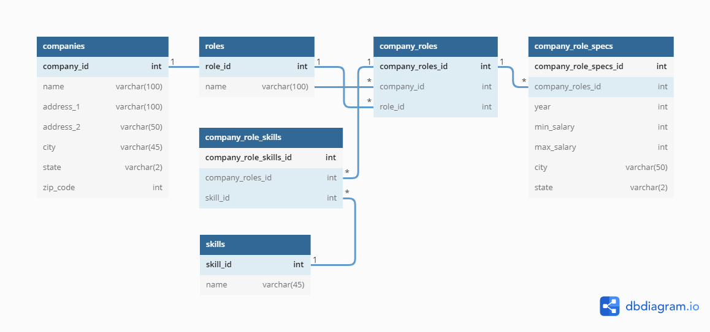

# A Government and Public Data derived Datawarehouse for Job Opportunities in the FinTech Space

## Team:

  * **Brennan Eng** [brennanheng@gmail.com](brennanheng@gmail.com): <br>

    Brennan is a current Junior at the University of Illinois at Urbana-Champaign majoring in Computer Engineering. Brennan is graduating May 2023. In the summer of 2022, Brennan will be interning at Sychrony Financial as a Software Development Engineering intern. Brennan enjoys financial engineering, derivatives trading, programming in python and C++, focusing on data analysis and automation. To check out Brennan's specific projects checkout his [github](https://github.com/Brennaneng).

  * **Chayanid "Jeep" Kaewla** [ckaewla2@illinois.edu](ckaewla2@illinois.edu): <br>
    Jeep is a rising senior at the University of Illinois at Urbana-Champaign studying Computer Engineering. Jeep is graduating May 2023. In the summer of 2022, Jeep will be interning at Amazon as a Software Development Engineer intern. Jeep intends to pursue Master of Science in Computer Science in the Fall of 2023. Jeep is interested in HFT and innovating educational applications and devices. You can checkout more projects that Jeep has done [here](https://jeeepx.github.io/mySite/).

  * **Sanjana Pingali** [pingali4@illinois.edu](pingali4@illinois.edu): <br>
    Sanjana is a rising senior at the University of Illinois at Urbana-Champaign planning to graduate with a Bachelor of Science in Computer Engineering in May 2023. Sanjana will be a research intern with the National Center for Supercomputing Applications the Summer of 2022. Sanjana is interested in the fields of machine learning, data analysis and software development.

  * **Ashley Yeah** [ashelyeah@gmail.com](ashelyeah@gmail.com): <br>

    Ashley is a rising senior at the University of Illinois at Urbana-Champaign planning to graduate with a Bachelor of Science in Computer Science in May 2023. In the summer of 2022, Ashley is interning at Uber as a Software Engineer Intern. Ashley is always curious about innovations in technology, especially in the fields of database systems, machine learning, and software development tools. You can checkout more about Ashley [here](https://ashleyyeah.github.io/).

*** 

## Project Description:

  [Link to Project Video](https://drive.google.com/file/d/1AGIBNK9-KmrMDIr8aBwMrimk63ZdAR-u/view?usp=sharing)
  This is the team's _"IE498 – High Frequency Trading"_ semester long project under the supervision of Professor David Lariviere [link to his webpage](https://davidl.web.illinois.edu/). This project is a public data and government dervied datawarehouse specifically for financial technology job opporunities. This application uses HFT-related data sources including Indeed Job Postings, NSCC Documents, performance data from the US Department of Labor, H1B work visa documents from USCIS (US Citizenship and Immigration Services), and SEC data. Most of these documents are required by FinTech companies to be submitted publically to the US government ranging from hiring non US Citizens to locations of their offices.


  This project collects data using a variety of methods including webscraping and simple downloads. It then aggregates the data from all sources using [Reconcile-csv](https://okfnlabs.org/reconcile-csv/), which relies on [OpenRefine](https://openrefine.org/), an open-source tool that allows for fuzzy matching in order to group relevant and similar values from different data sources together and eliminate occurences of duplicate data. Once the data is collected and cleaned, Pandas, a powerful python data analysis tool is used to eliminate unnecessary information and format the data into coherent, unifed, and organized datasets, each with their own unique IDs. Loading the datasets onto our SQL database, we are able to utilize web development technologies to create a friendly user environment to interact with our dataset.

  The GUI has 4 main features to showcase based on the search paramteres given by the user. 
  1. A data table that will display values from our database.
  2. A graph that will display a historical salary trendline specifically for the company.
  3. A graph that will display a historical salary trendline for the particular position averaged across all companies with the position
  4. A graphical comparison of historcial salary trendlines between 2 selected skills averaged across all positions and companies that have the skill listed

***
## Technologies:
  - Database:
    - MySQL
  - Web Developement:
    - Frontend: [React](https://reactjs.org/)
      - React Libraries:
        - Autocomplete fields: [Mui autocomplete](https://mui.com/material-ui/react-autocomplete/)
        - Salary Slider: [Mui slider](https://mui.com/material-ui/react-autocomplete/)
        - Display Graphs:[ Recharts](https://recharts.org/en-US/)
        - Display Tables:[ Mui](https://mui.com/)
    - Backend: Flask
        - Handling Cross Origin Resource Sharing: [CORS](https://flask-cors.readthedocs.io/en/latest/)
        - MySQL connection: 
  - Webscraping:
    - Python
    - [Beautiful Soup](https://beautiful-soup-4.readthedocs.io/en/latest/)
  - Data Cleaning and Formatting:
    - Python
    - [Pandas](https://pandas.pydata.org/)
    - [Reconcile-csv](https://okfnlabs.org/reconcile-csv/)
    - [OpenRefine](https://openrefine.org/)
    - [USPS Address Validation](https://github.com/IndianaCHE/USPS-Address-Verifier)
***
## Components:

  A diagram to showcase our components:

  

  - Database:
    - The database receives all data manually which has been cleaned and formatted through our **Data Formatting** process.
    - Once the virtual machine has been created with our sql database instantiated, the **Backend** programs will run automated SQL queries based on the search parameters received from the **Frontend** UI. 
    - The SQL database structure will look like this: 
    - Once those SQL queries have been created, the SQL database will send the specified data to the **Backend**.
  - Web Development:
    - Frontend:
      - Input (search parameters to be sent to the **Backend**):
        - The Frontend has been built with several autocomplete search bars for the user to create a custom search for available FinTech firms, available positions, available locations, and a specific salary range. Based on the selections, the **Backend** will automatically send an updated list of options available to choose from for the remaining blank search bars.
        - Another feature would be the skills-salary comparison which is comprised of two autocomplete search bars that searches up skills listed in our database.
      - Output (data to be received from the **Backend**):
        - Once those search bars have been selected to the user's parameters, there are available buttons that all have different function calls for the **Backend**. 
          - The submit button will bring up a table with all data values from the **Backend** relevant to the search parameters.
          - The comp-role graph button will bring up a graph of a historical salary trendline of the position in the company.
          - The role graph button will bring up a graph of historical salary trendline of the position averaged across all companies.
          - The skill button will bring up a comparison graph between 2 historical salary trendlines of positions containing the searched skills.
    - Backend:
      - Received from the **Frontend**:
        - The Backend will receive a specific function call relating to a **Frontend** button with the provided search parameters of the **Frontend** search boxes.
      - Sent to the **Frontend**:
        - The Backend will send compiled JSON formatted files with relevant data for the **Frontend** to view and display.
      - Received from the **SQL Database**:
        - The **SQL database** will send back relevant data to the queries and the python program will perform any necessary changes to the data format.
      - Sent to the **SQL Database**:
        - The Backend will have customized queries based on the **Frontend** parameters that it will send to the **SQL Database** so that it can search for relevant data.
  - Webscraping:
    - Utilized Python web scraping tools for relevant data sources mentioned in **Project Description**.
  - Data Formatting
    - Utilized [Reconcile-csv](https://okfnlabs.org/reconcile-csv/) in order to compare and recognize the same companies under slightly different names
    - Used Python functions and Pandas to aggregate data from all sources into combined csvs with unique ID's, which are used by the **SQL Database** to sort by.

***
## Git Repo Layout:
  - Backend:
    - contains the file app.py which manages all the custom queries to the SQL database based on the search parameters of the Frontend.
  - Companies, Company_role_skills, Company_role_specs, H1b_CSV, Roles, SEC_CSV:
    - contains jupyter notebooks that contain processes used to extract and compile the corresponding csv, as well as the raw and cleaned, formatted data of the SQL database in csv format.
  - Indeed_scraping:
    - contains a web scraping python file for the indeed website to retrieve data about FinTech job opportunities.
  - Interface:
    - contains the Frontend design as well as the customized graph and table displays that is received from the Backend
  - Mysql:
    - contains a shellscript that automatically loads the VM with the required SQL dump.
  - Provision_scripts:
    - contains the shellscript to begin the whole application with the command line "vagrant up --provision" as well as install other necessary packages for the project.
  - Skills:
    - contains a python script that extracts and compiles a list of skills from the previously mentioned cleaned, formatted data.
  - WebScrape:
    - contains python files that web scrapes the [H1B website](https://h1bdata.info) for necessary data and formats them.
  - Vagrantfile:
    - Ruby file that helps instantiate the Vagrant VM.
***
## Instruction for Running the Project:
  1. Install:
    * Fedora-35
    * Vagrant
    * Oracle VM Virtualbox
  2. Type into terminal ```git clone https://gitlab.engr.illinois.edu/ie598_high_frequency_trading_spring_2022/ie498_hft_spring_2022_group_06/group_06_project.git```
  3. Type into terminal ```vagrant up --provision``` to start the VM
  4. SSH into a terminal with the host as **mysql** and the password as **vagrant** and it should pop up the user as **vagrant@mysql**
  5. Type into VM terminal ```git clone https://gitlab.engr.illinois.edu/ie598_high_frequency_trading_spring_2022/ie498_hft_spring_2022_group_06/group_06_project.git```
  6. Type into VM terminal ```(cd group_06_project && (cd backend ; flask run --host=0.0.0.0 --port=5000 &) && (cd interface ; npm start &))```
  7. The application should pop up a web browser with its React App for the user.
  8. Enjoy using our GUI and the database behind it!
***
## Testing:


***
## Project Results:
The final results for the project are in the form of two deliverables that are displayed on the frontend of the website. The first is the table that is the result of the querying done when the search options are filled up. This query is then filled up in the table which can be seen on the side when we hit submit. Another way, the data is displayed is in the form of three graphs one that shows how positions and their salaries have changed over time, another of how salaries of different positions have chnaged over time and finally, comparing the roles in the same company.

***
## Screenshots and Example Outputs:


