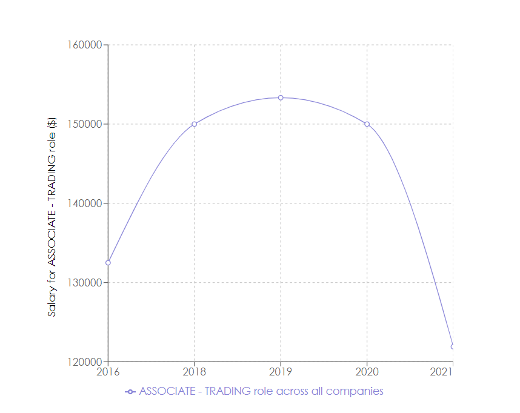

# group_06_project

This is the base project for Group 06 for IE498 HFT in Spring 2022.


## Teammates:

Brennan Eng bheng2@illinois.edu (Team Leader) \
Jeep Kaewla ckaewla2@illinois.edu \
Ashley Yeah ayeah2@illinois.edu \
Sanjana Pingali pingali4@illinois.edu 

## Project Description:
This project is a public data and government dervied datawarehouse specifically for financial technology job opporunities. This application uses HFT-related data sources including Indeed Job Postings, NSCC Documents, performance data from the US Department of Labor, H1B work visa documents from USCIS (US Citizenship and Immigration Services), and SEC data.

## READFILE Important Information (HOW TO USE APPLICATION):
In order to run the application, the specified software mentioned below must be installed. Afterwards, clone this repository and type into the command line ```vagrant up --provision``` in order to create a VM with our SQL database instantiated with the existing data we have collected so far. The command line will also automatically install all other programs and languages necessary to run this application. **Javascript/React** will run the frontend, **Python/Flask** will run the backend, and **MySQL** will run the database. After the VM has been instantiated, SSH into a terminal with the vm as a host **(user should be vagrant@mysql)** and type into the terminal ```(cd group_06_project && (cd backend ; flask run --host=0.0.0.0 --port=5000 &) && (cd interface ; npm start &))``` in start the backend and frontend GUI. After the React app has finished compiling in the web browser, there are many different options to choose from. By choosing a specific Fintech related firm from our options, a job position within firm, and a location where the job is held, the user can view different data analytics of the specified search. 

## Data Analysis Features of the HFT Database Application:

1. ### Data Table search parameter:
  the user can view all entries that fit the user's search parameters using the **`submit`** button.
  An example of this feature can be shown below:
  

  In this example, the firm chosen was **Alliance Bernstein LLC** and the position chosen was **Web Developer**. The table feature showcases all relevant data entries with those search parameters.

2. ### Company Role Data Analysis:
  the user can view historical salaries of the role within the company based on time with the **`comp-role graph`** button. 
  An example of this feature can be shown below:
  

  In this example, the firm chosen was **Bank of America** and the role chosen was an **Associate-Trading** where the user can see that the peak salary for this role was $160000 in 2019 and has since stabilized at $150000 in 2020 and 2021.

3. ### Role Data Analysis:
  The user can also view historical salaries on the specified role based on time with the **`role graph`** button.
  An example of this feature can be shown below:
  

  In this example, the role was **Associate-Trading** where the salary of the role peaked at 2019 with a salary of $153333 on average across all companies with this position. The average salary later falls off the next two years in 2020 and 2021. Compared to the previous example with Bank of America, the average is much lower compared to Bank of America's average salary for the exact same position. We can see that based on salary, Bank of America's position pays much more in recent years on average to its other firms with the same role.

4. ### Skill Value Analysis:
  The user can also view and compare different skills and the impact of those salaries based on those skills. Below the other buttons, we can select two different skills to compare and the trend of the salaries containing those skills on the graph. The user can see these with the **`compare skill`** button.
  An example of this feature can be shown below:
  

  In this example, the skills that are being compared are **Quantiative Analysis** and **Programming**. We can see that the trend is that firms are willing to pay more on average for programming skills than quantitative analysis skills though both skills are referenced in positions that are trending upwards in salary in recent years representing the increase of demand in these skills within the Fintech industry.

## Software required for application:
* Fedora-35
* Vagrant
* Oracle VM Virtualbox

## Software that will be installed with the application:
* MySQL
* Javascript
* React
* Python
* Flask


