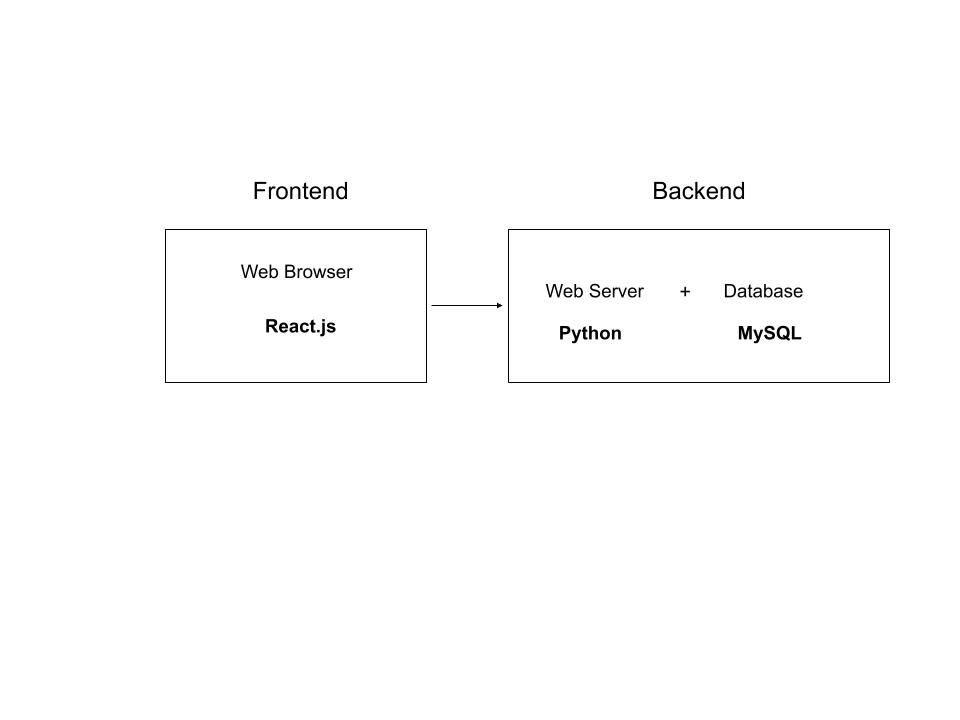
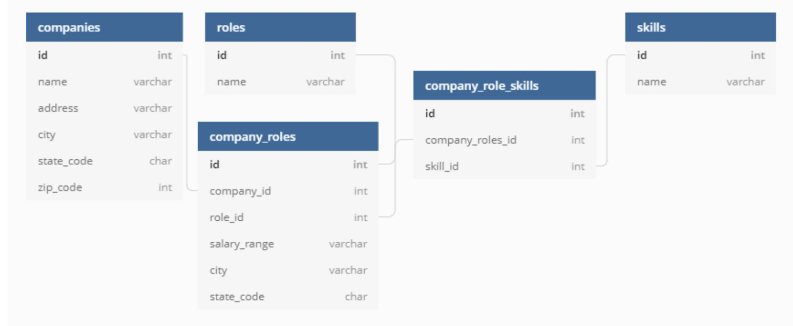
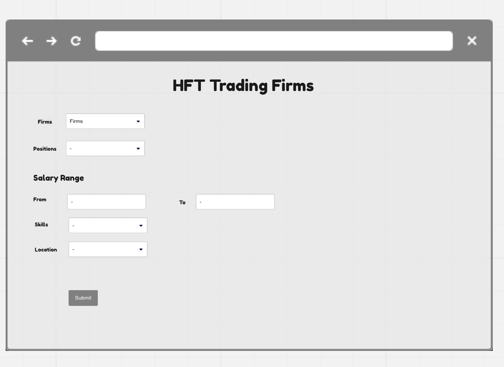
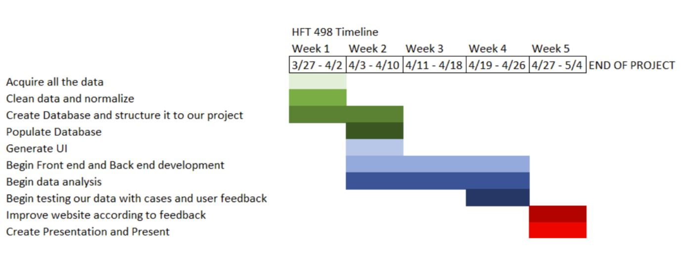

# **Design Document**

## **Title: HFT Company Database**

## **Project Summary**
   In this project, we aim to create a database that contains useful information about job positions in high frequency trading firms, including available positions, salary range for each position based in each city, desirable skills, and how frequently each skill is demanded. The database will also contain information about each company, such as its address. After acquiring all this information, we plan to perform some data analysis, such as what is the marginal $ for each skill, up-coming trends of which companies are aggressively hiring, and comparisons on which companies may fit the conditions the users have set . We plan to display the result in a web GUI.

## **Technologies**
- Frontend: React/JS
- Backend: Python
- Database: MySQL - server hosted on vm

## **Software/Libraries**
- Vagrant 2.2.19
- VirtualBox 6.1
- MySQL Community Server 8.0.28
- SQLAlchemy 1.4.32
- Flask

## **Diagram of how frontend backend and database communicates**

## **Usefulness**
This database will allow end users to be able to use a website to search through high frequency trading firms and filter job positions based on different criteria useful to the user. It can be very useful to those searching for the job to see how their own interests and skills match those of the company.

## **Data Sources**

### **Databases**
- SEC: [Company Information About Active Broker-Dealers](https://www.sec.gov/help/foiadocsbdfoiahtm.html)
- H1B: [H-1B Employer Data Hub Files](https://www.uscis.gov/tools/reports-and-studies/h-1b-employer-data-hub/h-1b-employer-data-hub-files)
- CME: [List of Clearing Firms](https://www.cmegroup.com/clearing/financial-and-regulatory-surveillance/clearing-firms.html)
- FCC: [List of Databases for FCC registrations](https://www.fcc.gov/licensing-databases/search-fcc-databases)

### **APIs**
- Indeed: [Indeed Job Description Scraper](https://github.com/UmaisZahid/Indeed-Job-Scraper) 
- Google Jobs: [Jobs Listings from Google Jobs | SerpApi](https://medium.com/serpapi/how-to-scrape-jobs-listings-from-google-jobs-4759bc44bfe9) 
- Glassdoor: [Glassdoor Companies Search](https://www.glassdoor.com/developer/companiesApiActions.htm)

## **Tools**

### **APIs**

<table>
  <tr>
   <td><strong> Name & Embedded Link</strong>
   </td>
   <td><strong>Usefulness</strong>
   </td>
  </tr>
  <tr>
   <td>OpenCorporate

<a href="https://api.opencorporates.com/documentation/Open-Refine-Reconciliation-API">Open Refine Reconciliation API: version 0.4.8</a> 
   </td>
   <td>Company name normalization
   </td>
  </tr>
  <tr>
   <td>USPS Address APIs

<a href="https://www.usps.com/business/web-tools-apis/address-information-api.htm#_Toc39492052">Address Validation API</a> 
   </td>
   <td>Address normalization
   </td>
  </tr>
  <tr>
   <td>Workforce Initiative Skills API

<a href="https://github.com/workforce-data-initiative/skills-api/wiki/API-Overview?ref=public-apis#introduction">Open Skills API</a> 
   </td>
   <td>Normalizing job description skills
   </td>
  </tr>
  <tr>
   <td>Github Web Scraping API

<a href="https://github.com/configtheworld/web-scraping-jobs-api">Github Web Scraping API implementation</a>
   </td>
   <td>General Web Data scraping
   </td>
  </tr>
</table>

### **Rough Idea of the Columns in our Databases**

### **Rough UI**

## **Reference Lists**
### **potential projects** 
- [Indeed Job Scraper](https://github.com/UmaisZahid/Indeed-Job-Scraper)
### **Articles**
- [Build a Job Database using Indeed’s API](https://medium.com/@alberto_moura/build-a-jobs-database-using-indeeds-api-8f95316be842)
- [How to Scrape Job Listing from Google Jobs](https://mersakarya.medium.com/selenium-tutorial-scraping-glassdoor-com-in-10-minutes-3d0915c6d905)
- [How to Scrape Job Listing from Glassdoor](https://mersakarya.medium.com/selenium-tutorial-scraping-glassdoor-com-in-10-minutes-3d0915c6d905)
- [A Complete Guide to Web Scraping LinkedIn Job Postings](https://maoviola.medium.com/a-complete-guide-to-web-scraping-linkedin-job-postings-ad290fcaa97f)
- [Javascript/React Tutorial via Khan Academy](https://www.khanacademy.org/computing/computer-programming/html-css-js)
- [Web Scraping with Beautiful Soup](https://stackabuse.com/guide-to-parsing-html-with-beautifulsoup-in-python/)
- [React FrontEnd +  Python Flask backend Tutorial](https://www.youtube.com/watch?v=msEmUtYqVV0)

